## Ethnicity

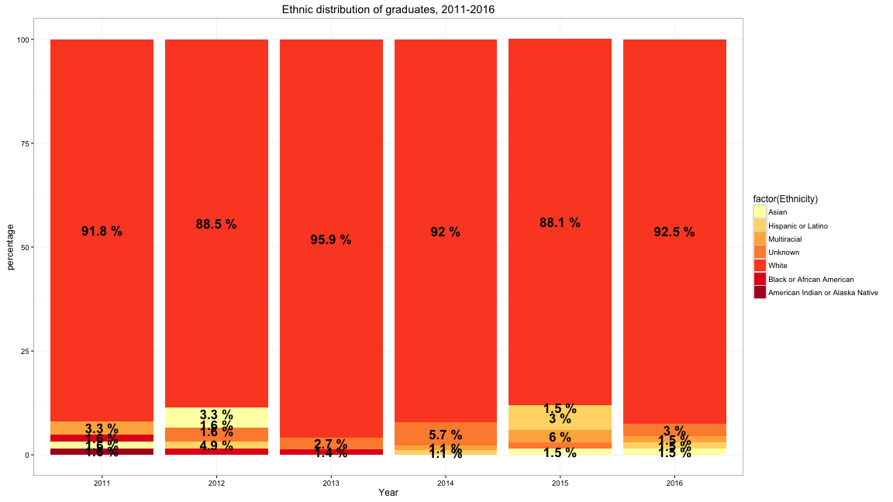

--- .class #id 

## Non-White population, with Comparison

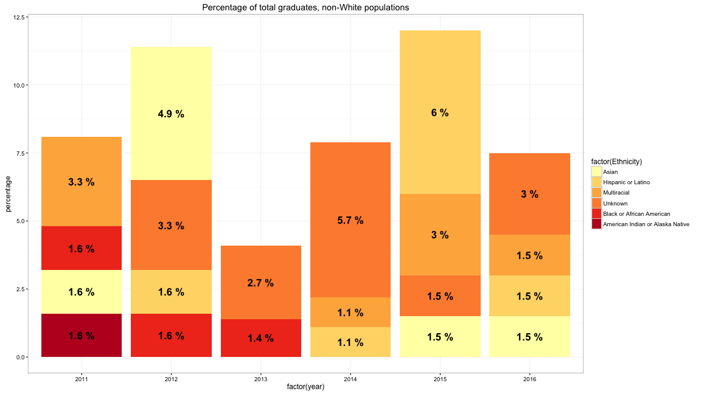

--- .class #id

## Gender Comparison

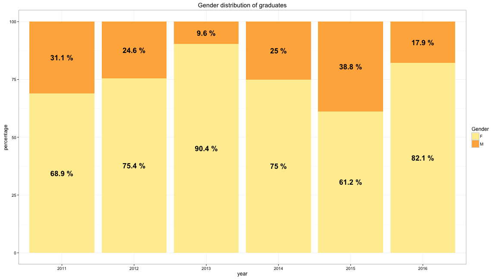

--- .class #id

## By College

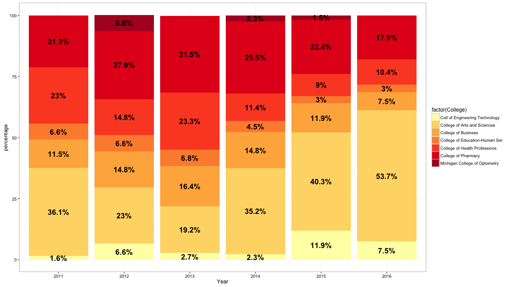

--- .class #id

## By Major

```
##                         Major Frequency
## 22                   Pharmacy        12
## 24               Pre-Pharmacy         9
## 5                     Biology         5
## 8      Biology - Pre-Medicine         5
## 21              Nursing - BSN         5
## 10     Biology - Pre-Pharmacy         3
## 25                 Psychology         3
## 7     Biology - Pre-Dentistry         2
## 9     Biology - Pre-Optometry         2
## 11 Biology - Pre-Phys Therapy         2
```

--- .class #id

## Other demographics of interest

Student Atheletes: 6

First-generation: 14

--- .class #id

## Comparison

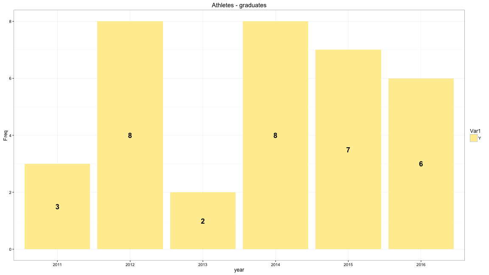

--- .class #id

## Comparison

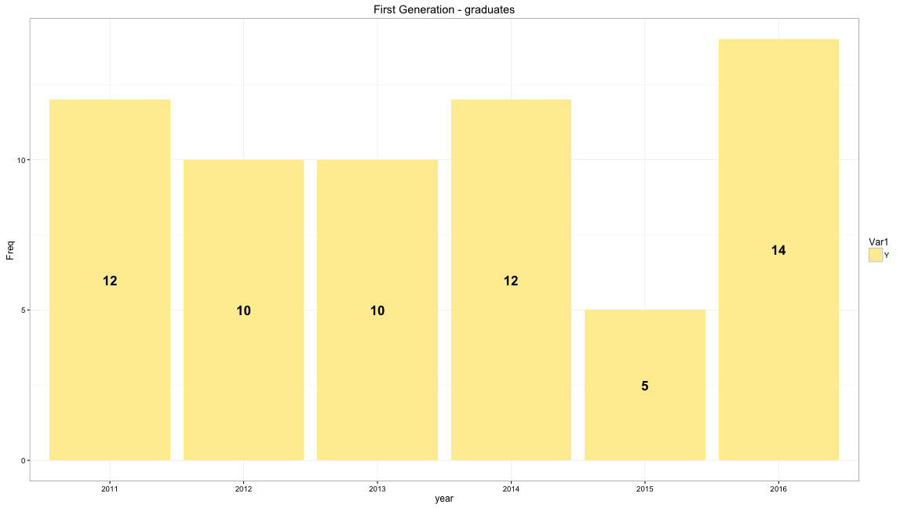

--- .class #id

## As entering Students

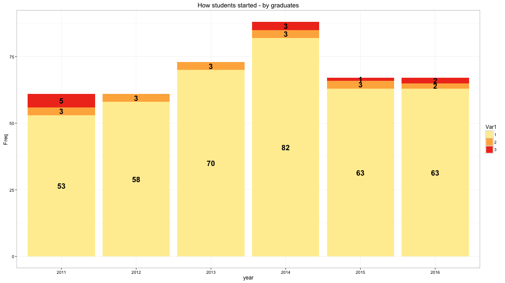

--- .class #id


## Input Conditions: HS_GPA  and ACT_COMP

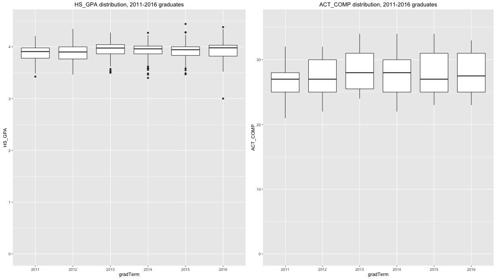


--- .class #id

## How they finished - CumGPA Spring 2016

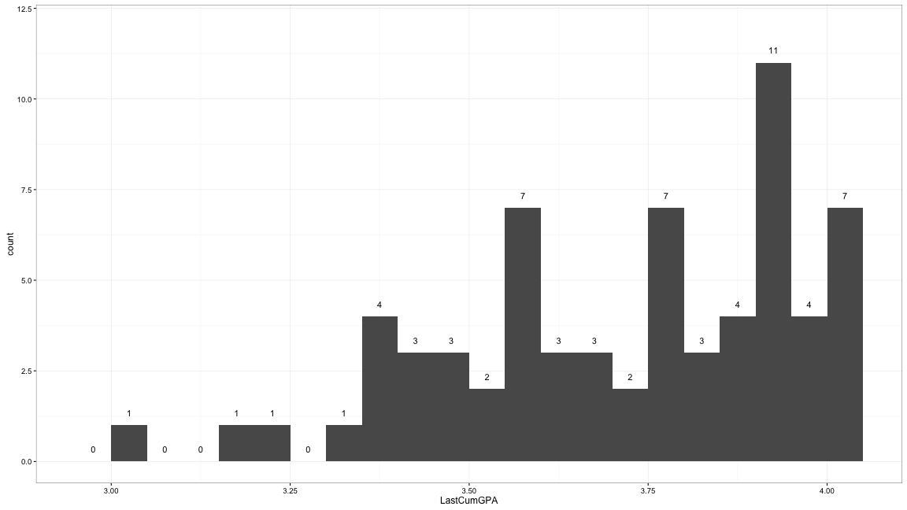

--- .class #id

## In Comparison 

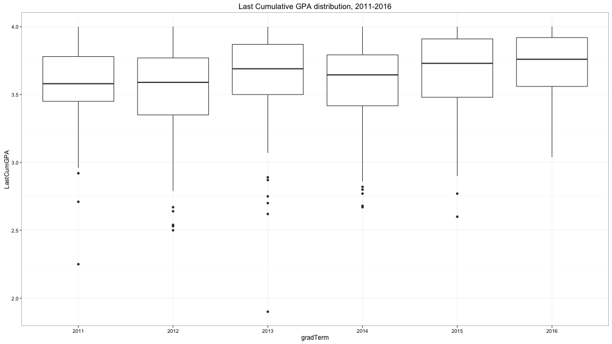

--- .class #id

## App for Medallion: How much education?


```
##                            
##                             201501 201508 201601
##   1-2 years of graduate or      14      0     17
##   Bachelor's or equivalent       6      1      3
##   Doctoral degree such as M     28      1     45
```

--- .class #id

## App for Medallion: Completion plans


```
##                               
##                                201501 201601
##   Final practicum / internship      2      1
##   Graduate with AA / AS / AAS       0      9
##   Graduate with BA / BS            52     44
##   Professional school              14     15
```

--- .class #id

## App for Medallion: Internship


```
##      
##       201501 201601
##   No      33     44
##   Yes     34     25
```

--- .class #id

## App for Medallion: Study abroad


```
##      
##       201501 201601
##   No      57     52
##   Yes     11     17
```


--- .class #id

## A little assessment: Cultural events - 2016

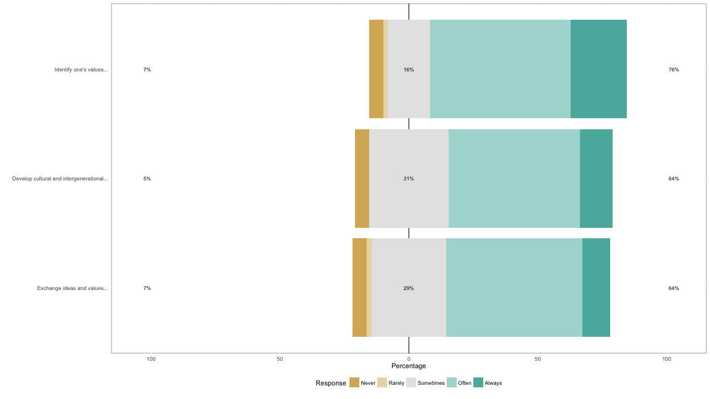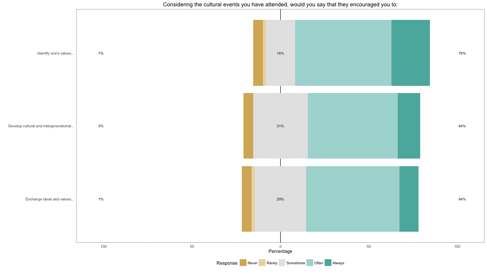

--- .class #id

## A little assessment: Cultural events - 2015

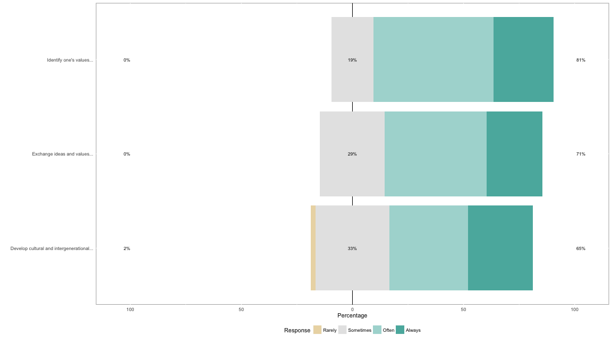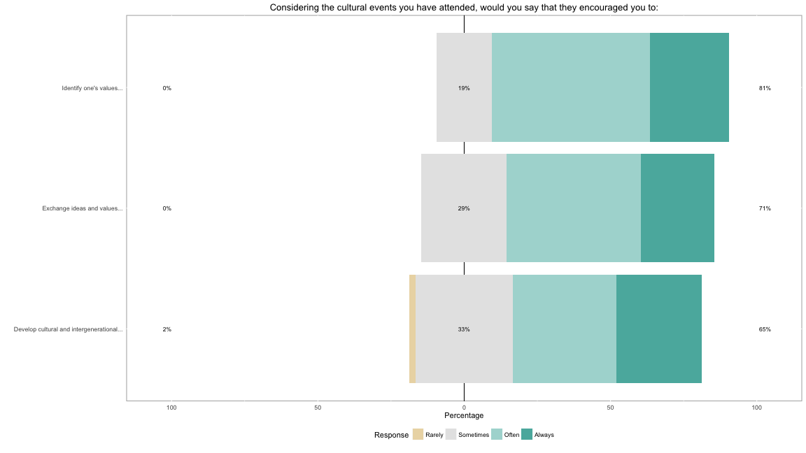

--- .class #id

## Quick Assessment: Service

### 2016
60 of 69, or 87% expressed a commitment to continue community service.

### 2015
67 of 68, or 98.5% expressed a commitment to continue community service.


--- .class #id

## Qualitative Service

Aryn Cowley
"The most meaningful service experience I had in Honors was volunteering at the Mother and Daughter TEA (technology,engineering, aptitude) events. During these events, mothers and daughters were exposed to engineering programs at Ferris and were able to work together to complete a small engineering project we had set up for them. I loved being able to be a role model to the younger girls and inspire them to become and engineer. I also enjoyed sharing my knowledge on the projects that the mothers and daughters were working on. Being able to tell my story of wanting to become and engineer and inspiring future generations of engineers is a great feeling.”

Zachary Kramer
"I had the incredible opportunity to volunteer abroad last summer. I traveled to the Dominican Republic with some of the Pre-Medicine Club. We spent a week traveling to rural villages while providing medical services…Aside from learning valuable healthcare skills, I met the kindest group of people I have ever encountered. The people we served were by far the poorest people I have ever seen. Even though we were there to serve them, they wanted to serve us.”

--- .class #id

## Qualitative Service

Bradley Bohle
On Service
"The most meaningful service project that I had while in Honors was helping out some of the flood victims by cleaning out their houses when the river flooded two years ago. It was sad that people lost so much but it had a great impact on me being able to help out some of those families.”

--- .class #id

## Qualitative - On Academics

Michelle Dam
"Honors Courses has prepared me to think critically. Without it, I would not be challenged through some of my courses.”

Alyssa Divens
"Honors Course were a place where people who valued academics at the same level as me were able to push each other to achieve better academic outcomes.”

"The Honors Courses actually meant a lot to me and I was able to take a lot from them. I also liked all the intelligent conversation that would come up in these classes."

--- .class #id

## Proud

Melissa Kuziak
"I will be attending graduate school in the fall to obtain a Master's degree Criminology. I hope to eventually get my Ph.D.”

Ary Cowley
"After completing the Honors program and graduating with my Bachelor of Science degree in Surveying Engineering from Ferris State, I plan to attend Purdue University in the fall of 2016 and attain a Master's of Science in Engineering with a focus in Photogrammetry.”

Nicole Outman
"After completing the Honors program I plan to continue my education at Central Michigan University, working towards a Ph.D. in School Psychology.”

Alexandra Costa
"I will be attending Quinnipiac University in North Haven, CT to earn my Master's degree in Pathology.”

--- .class #id

## Proud

Aaron Zebolsky
"Entering a Masters of Science in Cancer Chemical Biology at the University of Michigan, then entering medical school and pursuing a career in oncology."

Eli Fesler
“I am Going to work at DENSO Manufacturing Michigan, INC in Battle Creek, Michigan as a Design Engineer.”

Andrea Crapsey
"After graduation in August, I will be working full time as a Registered Nurse at Metro Health Hospital in Grand Rapids on the Progressive Care Unit. This will be a stepping stone to my dream job in the Intensive Care Unit. After starting my new job I am looking forward to getting married!”

Melanie Lobsinger
"I will be working at Champlin Architecture in Cincinnati, OH. I am planning to go to graduate school in 3-4 years."

--- .class #id

## Proud

Lindsey Berndt
"I will be starting school at University of New England's College of Dental Medicine in the fall.”

Marie MacDonnell
"After completing the Honors program, I will be attending GVSU for my doctorate in nursing practice.”

Bradley Bohle
"I plan on going to work for Walsh Construction out of their Indiana Office on various heavy civil projects throughout the Midwest. I might go back to school for my masters in business at some point."

Ashley Beaudry
"I plan to graduate from Ferris and the Honors Program this May, after which I will begin graduate school in the fall at Marquette University's Physician's Assistant Program.”

Katherine Hart
"I will be attending medical school (Michigan State University's College of Human Medicine) in the fall of 2016.”

--- .class #id

## Trends we're watching

Retention to completion - esp. of professionals
