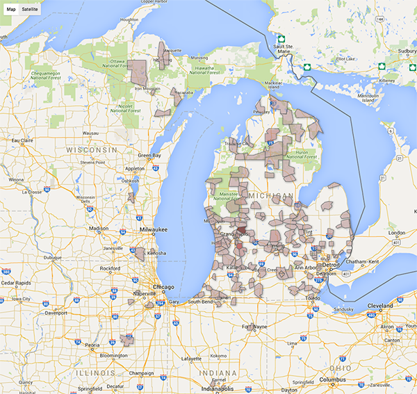
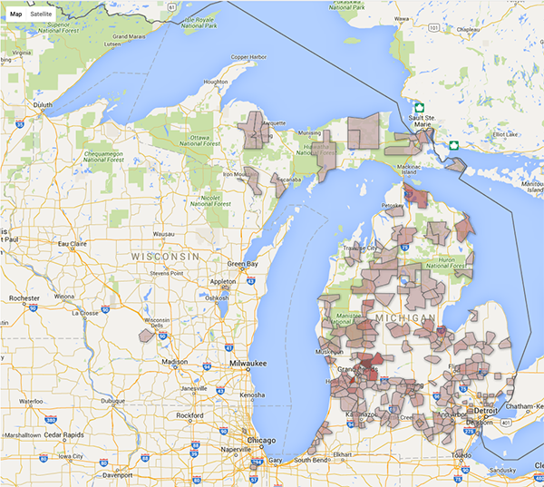

```{r echo=FALSE, message=FALSE, warning=FALSE, error=FALSE, cache=FALSE}
ggcolor <- "YlOrRd"
source("EnrollmentDescriptives.R")
source("MakeStackedCol.R")
library(googlesheets)
library(plyr)
fall2010 <- getorientation("201008")
fall2010$FirstCollege[fall2010$FirstCollege == "College of Allied Health"] <- "College of Health Professions"
fall2011 <- getorientation("201108")
fall2011$FirstCollege[fall2011$FirstCollege == "College of Allied Health"] <- "College of Health Professions"
fall2012 <- getorientation("201208")
fall2012$FirstCollege[fall2012$FirstCollege == "College of Allied Health"] <- "College of Health Professions"
fall2013 <- getorientation("201308")
fall2013$FirstCollege[fall2013$FirstCollege == "College of Education-Human Services"] <- "College of Education-Human Ser"
fall2013$FirstCollege[fall2013$FirstCollege == "College of Engineering Technology"] <- "Coll of Engineering Technology"
fall2014 <- getorientation("201408")
fall2014$FirstCollege[fall2014$FirstCollege == "College of Education-Human Services"] <- "College of Education-Human Ser"
fall2014$FirstCollege[fall2014$FirstCollege == "College of Engineering Technology"] <- "Coll of Engineering Technology"
fall2015 <- getorientation("201508")
fall2015$FirstCollege[fall2015$FirstCollege == "College of Education-Human Services"] <- "College of Education-Human Ser"
fall2015$FirstCollege[fall2015$FirstCollege == "College of Engineering Technology"] <- "Coll of Engineering Technology"
fall2016 <- getorientation("201608")
fall2016$FirstCollege[fall2016$FirstCollege == "College of Education-Human Services"] <- "College of Education-Human Ser"
fall2016$FirstCollege[fall2016$FirstCollege == "College of Engineering Technology"] <- "Coll of Engineering Technology"
total <- rbind(fall2010, fall2011, fall2012, fall2013, fall2014, fall2015, fall2016)
total$FirstCollege[total$FirstCollege == "College of Allied Health"] <- "College of Health Professions"
total$FirstCollege[total$FirstCollege == "College of Education - Human Services"] <- "College of Education-Human Ser"
total[grep("*08", total$Term), ] -> total
total$Term <- factor(total$Term)
```


## Ethnicity

```{r echo=FALSE, fig.width=16, fig.height=9, cache=FALSE}
byethnicity16 <- as.data.frame(table(fall2016$Ethnicity))
byethnicity16$year <- "2016"
byethnicity16$percentage <- round((byethnicity16$Freq / sum(byethnicity16$Freq)) * 100, 1)

byethnicity15 <- as.data.frame(table(fall2015$Ethnicity))
byethnicity15$year <- "2015"
byethnicity15$percentage <- round((byethnicity15$Freq / sum(byethnicity15$Freq)) * 100, 1)

byethnicity14 <- as.data.frame(table(fall2014$Ethnicity))
byethnicity14$year <- "2014"
byethnicity14$percentage <- round((byethnicity14$Freq / sum(byethnicity14$Freq)) * 100, 1)

ethnicityTotal <- rbind(byethnicity16, byethnicity15, byethnicity14)
colnames(ethnicityTotal) <- c("Ethnicity", "count", "year", "percentage")
ethnicityTotal$Ethnicity <- factor(ethnicityTotal$Ethnicity)
toplot <- ethnicityTotal[ethnicityTotal$Ethnicity != "White",]
toplot <- ddply(toplot, .(year), 
   transform, pos = cumsum(percentage) - (0.5 * percentage)
)
ggplot(toplot, aes(x=factor(year), y=percentage, fill=Ethnicity)) + geom_bar(stat="identity", aes(fill=Ethnicity)) + geom_text(aes(label = paste(percentage, "%")), colour="Black", fontface="bold", size=6, y=toplot$pos) + scale_y_continuous() -> p
p <- p + ggtitle("Ethnic distribution of FTIACs, 2014-2016") + xlab("Year") 
p <- p + scale_fill_brewer(type = "div", palette =  ggcolor) + theme_bw()
divChart <- p
p
```

--- .class #id

## By college - Comparison

```{r echo=FALSE, fig.width=16, fig.height=9, cache=FALSE}
getplace <- function(data, var) { which(colnames(data) == var) }
var <- "FirstCollege"
type <- "percent"
  bygender16 <- as.data.frame(table(fall2016[,getplace(fall2016, var)]))
  if(length(bygender16) == 1) {
    bygender16 <- data.frame(Var1 = "Y", Freq = 0)
  }
  bygender16$percentage <- round((bygender16$Freq / sum(bygender16$Freq)) * 100, 1)
  bygender15 <- as.data.frame(table(fall2015[,getplace(fall2015, var)]))
  if(length(bygender15) == 1) {
    bygender15 <- data.frame(Var1 = "Y", Freq = 0)
  }
  bygender15$percentage <- round((bygender15$Freq / sum(bygender15$Freq)) * 100, 1)
  bygender14 <- as.data.frame(table(fall2014[,getplace(fall2014, var)]))
  if(length(bygender14) == 1) {
    bygender14 <- data.frame(Var1 = "Y", Freq = 0)
  }
  bygender14$percentage <- round((bygender14$Freq / sum(bygender14$Freq)) * 100, 1)
  
  bygender13 <- as.data.frame(table(fall2013[,getplace(fall2013, var)]))
  bygender13$percentage <- round((bygender13$Freq / sum(bygender13$Freq)) * 100, 1)
#  message(paste("here", nrow(bygender13), sep=" "))
  bygender12 <- as.data.frame(table(fall2012[,getplace(fall2012, var)]))
  bygender12$percentage <- round((bygender12$Freq / sum(bygender12$Freq)) * 100, 1)
  
  bygender11 <- as.data.frame(table(fall2011[,getplace(fall2011, var)]))
  bygender11$percentage <- round((bygender11$Freq / sum(bygender11$Freq)) * 100, 1)
  
  bygender10 <- as.data.frame(table(fall2010[,getplace(fall2010, var)]))
  bygender10$percentage <- round((bygender10$Freq / sum(bygender10$Freq)) * 100, 1)
#  message(paste("here", nrow(bygender13), sep=" "))

  bygender16$year <- "2016"
  bygender15$year <- "2015"
  bygender14$year <- "2014"
  bygender13$year <- "2013"
  bygender12$year <- "2012"
  bygender11$year <- "2011"
  bygender10$year <- "2010"
#  message("here2")
  myTotal <- rbind(bygender16, bygender15, bygender14, bygender13, bygender12, bygender11, bygender10)
  myTotal$Var1 <- factor(myTotal$Var1)
 # message(myTotal)
  if (type == "percent") {
    myTotal <- ddply(myTotal, .(year), 
                         transform, pos = cumsum(percentage) - (0.5 * percentage)
    )
    p <- ggplot(myTotal, aes(x=year, y=percentage, fill=Var1)) + geom_bar(stat="identity") + geom_text(aes(label = paste(percentage, "%")), colour = "black", fontface="bold", size=6, y=myTotal$pos) + scale_y_continuous()
  } else {
    myTotal <- ddply(myTotal, .(year), 
                         transform, pos = cumsum(Freq) - (0.5 * Freq)
    )
    p <- ggplot(myTotal, aes(x=year, y=Freq, fill=Var1)) + geom_bar(stat="identity") + geom_text(aes(label = paste(Freq)), colour = "black", fontface="bold", size=6, y=myTotal$pos) + scale_y_continuous()
  }
p <- p + ggtitle("FirstCollege - FTIACs")
p <- p + scale_fill_brewer(type = "div", palette =  ggcolor) + theme_bw()
p
```

--- .class #id

## Gender Comparison

```{r, echo=FALSE, fig.width=16, fig.height=9, cache=FALSE}
#bygender16 <- as.data.frame(table(fall2016$Gender))
#bygender16$percentage <- round((bygender16$Freq / sum(bygender16$Freq)) * 100, 1)

bygender15 <- as.data.frame(table(fall2015$Gender))
bygender15$percentage <- round((bygender15$Freq / sum(bygender15$Freq)) * 100, 1)

bygender14 <- as.data.frame(table(fall2014$Gender))
bygender14$percentage <- round((bygender14$Freq / sum(bygender14$Freq)) * 100, 1)

bygender13 <- as.data.frame(table(fall2013$Gender))
bygender13$percentage <- round((bygender13$Freq / sum(bygender13$Freq)) * 100, 1)

bygender12 <- as.data.frame(table(fall2012$Gender))
bygender12$percentage <- round((bygender12$Freq / sum(bygender12$Freq)) * 100, 1)

bygender11 <- as.data.frame(table(fall2011$Gender))
bygender11$percentage <- round((bygender11$Freq / sum(bygender11$Freq)) * 100, 1)

bygender10 <- as.data.frame(table(fall2010$Gender))
bygender10$percentage <- round((bygender10$Freq / sum(bygender10$Freq)) * 100, 1)


#bygender16$year <- "2016"
bygender15$year <- "2015"
bygender14$year <- "2014"
bygender13$year <- "2013"
bygender12$year <- "2012"
bygender11$year <- "2011"
bygender10$year <- "2010"
genderTotal <- rbind(bygender15, bygender14, bygender13, bygender12, bygender11, bygender10)
genderTotal$Var1 <- factor(genderTotal$Var1)
genderTotal <- ddply(genderTotal, .(year), 
   transform, pos = cumsum(percentage) - (0.5 * percentage)
)
ggplot(genderTotal, aes(x=year, y=percentage, fill=Var1)) + geom_bar(stat="identity") + geom_text(aes(label = paste(percentage, "%")), colour = "black", fontface="bold", size=6, y=genderTotal$pos) + scale_y_continuous()-> p
p <- p + ggtitle("Gender distribution of FTIACs")
p <- p + scale_fill_brewer(type = "div", palette =  ggcolor) + theme_bw()
p
```

--- .class #id

## Out of state - 2016

```{r echo=FALSE, fig.width=16, fig.height=9, cache=FALSE}
as.data.frame(table(fall2016$State_Corrected)) -> state2016
colnames(state2016) <- c("State", "Frequency")
state2016[order(-state2016$Freq),]
```

--- .class #id

## Out of state - 2015

```{r echo=FALSE, fig.width=16, fig.height=9, cache=FALSE}
as.data.frame(table(fall2015$State_Corrected)) -> state2015
colnames(state2015) <- c("State", "Frequency")
state2015[order(-state2015$Freq),]
```

--- .class #id

## Input Vars
```{r echo=FALSE, warning=FALSE, fig.width=16, fig.height=9, cache=FALSE}
p <- ggplot(total, aes(x=Term, y=HS_GPA)) + geom_boxplot()
p <- p + ggtitle("HS_GPA distribution, 2010-2016 graduates")
p <- p + scale_fill_brewer(type = "div", palette =  ggcolor) + theme_bw()


q <- ggplot(total, aes(x=Term, y=ACT_COMP)) + geom_boxplot()
q <- q + ylim(0, 36)
q <- q + ggtitle("ACT distribution, 2010-2016 graduates")
q <- q + scale_fill_brewer(type = "div", palette =  ggcolor) + theme_bw()

multiplot(p, q, cols=2)
```

--- .class #id

## Geography - 2016

* Note: range of color: 1-9, max (Rockford) = 13



--- .class #id

## Geography - 2015

* Note: range of color: 1-9, max (Rockford) = 9



--- .class #id

## What they are proud of:

* Audrey De Almeida is the current St Johns Mint Queen
* Katelyn Singer has written two books; Sarah Sikora has finished five. 
* Chiamaka Aroh participated in a biological analysis of the Detroit River with the  Rebuild Detroit Research Program. 
* Heather Wendlowsky’s theater group was one of three to perform at the International Thespian Society Festival. 
* Cameron Zeter served as president of Michigan Youth in Government for two years. 
* Caleb Jergens lived in China for two years started a personal photography business and created a Lego Club for Homeschooled Jr. High Students. 
* Rachel Striks swam in all of the Great Lakes in one day. 
* Angela Dato has been a member of the Detroit Tap Repertory since 2011. 
* This class includes at least 5 Eagle Scouts
* Joseph Bowen auditioned for America’s Got Talent.
* Robert Abbaduska’s robotics team reached the World Championships. 

--- .class #id

## Trends we're watching

* Pre-Pharm Decline
* Diversity increase
* Retention to completion

--- .class #id

## Trends we're watching: PrePharm

```{r echo=FALSE, fig.width=16, fig.height=9, cache=FALSE}
fall2016$isPrePharm[fall2016$FirstMajor == "Pre-Pharmacy"] <- "TRUE"
fall2016$isPrePharm[fall2016$FirstMajor != "Pre-Pharmacy"] <- "FALSE"
fall2015$isPrePharm[fall2015$FirstMajor == "Pre-Pharmacy"] <- "TRUE"
fall2015$isPrePharm[fall2015$FirstMajor != "Pre-Pharmacy"] <- "FALSE"
fall2014$isPrePharm[fall2014$FirstMajor == "Pre-Pharmacy"] <- "TRUE"
fall2014$isPrePharm[fall2014$FirstMajor != "Pre-Pharmacy"] <- "FALSE"
fall2013$isPrePharm[fall2013$FirstMajor == "Pre-Pharmacy"] <- "TRUE"
fall2013$isPrePharm[fall2013$FirstMajor != "Pre-Pharmacy"] <- "FALSE"
fall2012$isPrePharm[fall2012$FirstMajor == "Pre-Pharmacy"] <- "TRUE"
fall2012$isPrePharm[fall2012$FirstMajor != "Pre-Pharmacy"] <- "FALSE"
fall2011$isPrePharm[fall2011$FirstMajor == "Pre-Pharmacy"] <- "TRUE"
fall2011$isPrePharm[fall2011$FirstMajor != "Pre-Pharmacy"] <- "FALSE"
#p <- makechart("First_Generation", type="count")
var <- "isPrePharm"
type <- "count"
  bygender16 <- as.data.frame(table(fall2016[,getplace(fall2016, var)]))
  if(length(bygender16) == 1) {
    bygender16 <- data.frame(Var1 = "Y", Freq = 0)
  }
  bygender16$percentage <- round((bygender16$Freq / sum(bygender16$Freq)) * 100, 1)
  bygender15 <- as.data.frame(table(fall2015[,getplace(fall2015, var)]))
  if(length(bygender15) == 1) {
    bygender15 <- data.frame(Var1 = "Y", Freq = 0)
  }
  bygender15$percentage <- round((bygender15$Freq / sum(bygender15$Freq)) * 100, 1)
  bygender14 <- as.data.frame(table(fall2014[,getplace(fall2014, var)]))
  if(length(bygender14) == 1) {
    bygender14 <- data.frame(Var1 = "Y", Freq = 0)
  }
  bygender14$percentage <- round((bygender14$Freq / sum(bygender14$Freq)) * 100, 1)
  
  bygender13 <- as.data.frame(table(fall2013[,getplace(fall2013, var)]))
  bygender13$percentage <- round((bygender13$Freq / sum(bygender13$Freq)) * 100, 1)
#  message(paste("here", nrow(bygender13), sep=" "))
  bygender12 <- as.data.frame(table(fall2012[,getplace(fall2012, var)]))
  bygender12$percentage <- round((bygender12$Freq / sum(bygender12$Freq)) * 100, 1)
  
  bygender11 <- as.data.frame(table(fall2011[,getplace(fall2011, var)]))
  bygender11$percentage <- round((bygender11$Freq / sum(bygender11$Freq)) * 100, 1)
  
 
  bygender16$year <- "2016"
  bygender15$year <- "2015"
  bygender14$year <- "2014"
  bygender13$year <- "2013"
  bygender12$year <- "2012"
  bygender11$year <- "2011"
  type <- "count"
#  message("here2")
  myTotal <- rbind(bygender16, bygender15, bygender14, bygender13, bygender12, bygender11)
  myTotal$Var1 <- factor(myTotal$Var1)
 # message(myTotal)
  if (type == "percent") {
    myTotal <- ddply(myTotal, .(year), 
                         transform, pos = cumsum(percentage) - (0.5 * percentage)
    )
    p <- ggplot(myTotal, aes(x=year, y=percentage, fill=Var1)) + geom_bar(stat="identity") + geom_text(aes(label = paste(percentage, "%")), colour = "black", fontface="bold", size=6, y=myTotal$pos) + scale_y_continuous()
  } else {
    myTotal <- ddply(myTotal, .(year), 
                         transform, pos = cumsum(Freq) - (0.5 * Freq)
    )
    p <- ggplot(myTotal, aes(x=year, y=Freq, fill=Var1)) + geom_bar(stat="identity") + geom_text(aes(label = paste(Freq)), colour = "black", fontface="bold", size=6, y=myTotal$pos) + scale_y_continuous()
  }
p <- p + ggtitle("PrePharm - raw numbers")
p <- p + scale_fill_brewer(type = "div", palette =  ggcolor) + theme_bw()

  type <- "percent"
#  message("here2")
  myTotal <- rbind(bygender16, bygender15, bygender14, bygender13, bygender12, bygender11)
  myTotal$Var1 <- factor(myTotal$Var1)
 # message(myTotal)
  if (type == "percent") {
    myTotal <- ddply(myTotal, .(year), 
                         transform, pos = cumsum(percentage) - (0.5 * percentage)
    )
    q <- ggplot(myTotal, aes(x=year, y=percentage, fill=Var1)) + geom_bar(stat="identity") + geom_text(aes(label = paste(percentage, "%")), colour = "black", fontface="bold", size=6, y=myTotal$pos) + scale_y_continuous()
  } else {
    myTotal <- ddply(myTotal, .(year), 
                         transform, pos = cumsum(Freq) - (0.5 * Freq)
    )
    q <- ggplot(myTotal, aes(x=year, y=Freq, fill=Var1)) + geom_bar(stat="identity") + geom_text(aes(label = paste(Freq)), colour = "black", fontface="bold", size=6, y=myTotal$pos) + scale_y_continuous()
  }
q <- q + ggtitle("PrePharm - percentage of total FTIAC class")
q <- q + scale_fill_brewer(type = "div", palette =  ggcolor) + theme_bw()

multiplot(p, q, cols=2)
```

* note: 2014-2016 are 'confirmed' students.

--- .class #id

## Trends we're watching: Diversity

(already shown)

```{r echo=FALSE, fig.width=16, fig.height=9, cache=FALSE}
divChart
```

--- .class #id

## Trends we're watching: Retention to completion

* See 'Class of 2016' slides.