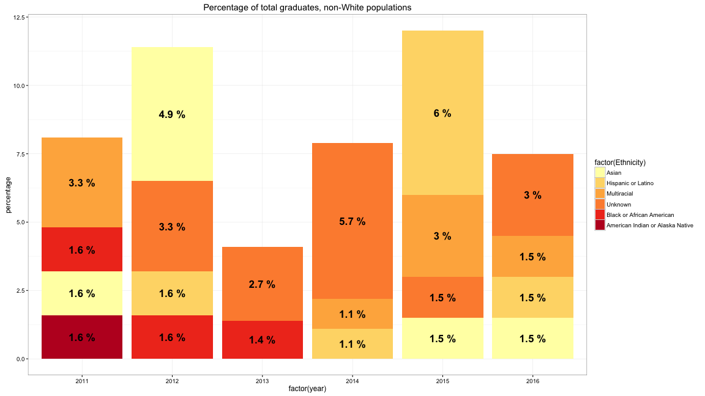
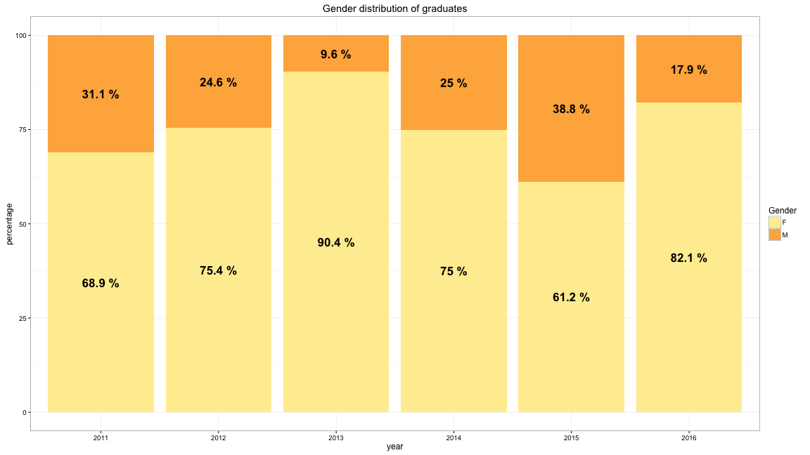
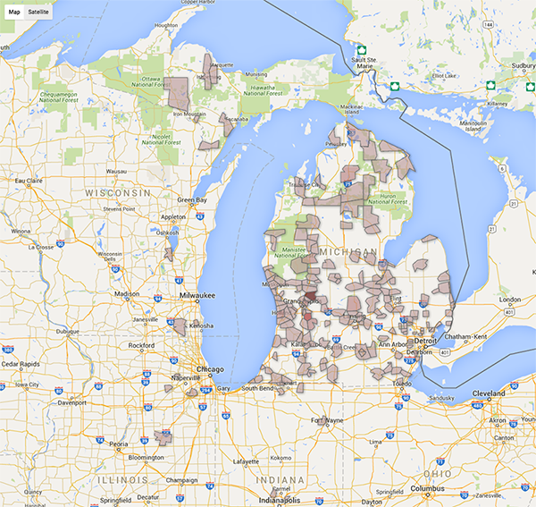
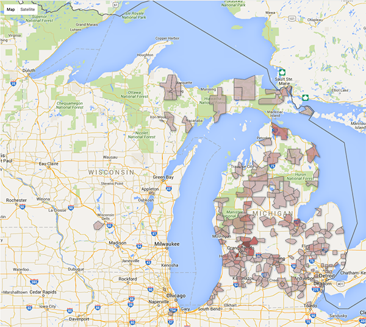
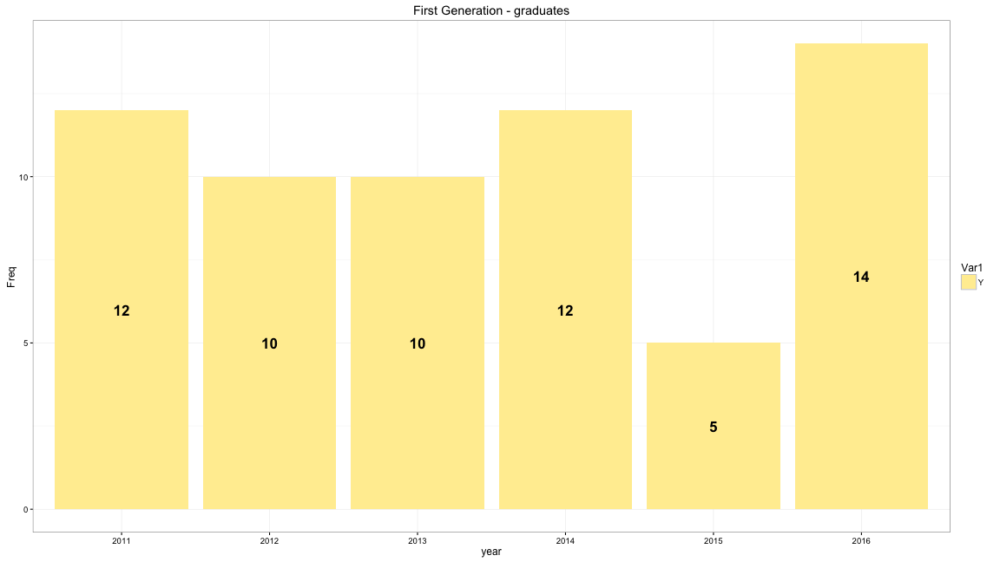

## Ethnicity


--- .class #id

## By college - Comparison



--- .class #id

## Gender Comparison



--- .class #id

## Out of state - 2016


```
##   State Frequency
## 4    MI       270
## 2    IL         9
## 3    IN         6
## 7    WI         3
## 1    AK         1
## 5    ON         1
## 6    WA         1
```

--- .class #id

## Out of state - 2015


```
##   State Frequency
## 2    MI       377
## 1    IL         5
## 4    NY         2
## 6    WI         2
## 3    MN         1
## 5    OH         1
```

--- .class #id

## Input Vars


--- .class #id

## Geography - 2016

* Note: range of color: 1-9, max (Rockford) = 13



--- .class #id

## Geography - 2015

* Note: range of color: 1-9, max (Rockford) = 9



--- .class #id

## What they are proud of:

* Audrey De Almeida is the current St Johns Mint Queen
* Katelyn Singer has written two books; Sarah Sikora has finished five. 
* Chiamaka Aroh participated in a biological analysis of the Detroit River with the  Rebuild Detroit Research Program. 
* Heather Wendlowsky’s theater group was one of three to perform at the International Thespian Society Festival. 
* Cameron Zeter served as president of Michigan Youth in Government for two years. 
* Caleb Jergens lived in China for two years started a personal photography business and created a Lego Club for Homeschooled Jr. High Students. 
* Rachel Striks swam in all of the Great Lakes in one day. 
* Angela Dato has been a member of the Detroit Tap Repertory since 2011. 
* This class includes at least 5 Eagle Scouts
* Joseph Bowen auditioned for America’s Got Talent.
* Robert Abbaduska’s robotics team reached the World Championships. 

--- .class #id

## Trends we're watching

* Pre-Pharm Decline
* Diversity increase
* Retention to completion

--- .class #id

## Trends we're watching: PrePharm



* note: 2014-2016 are 'confirmed' students.

--- .class #id

## Trends we're watching: Diversity

(already shown)


--- .class #id

## Trends we're watching: Retention to completion

* See 'Class of 2016' slides.
